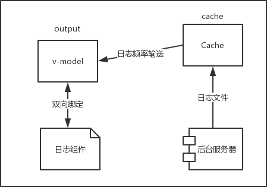
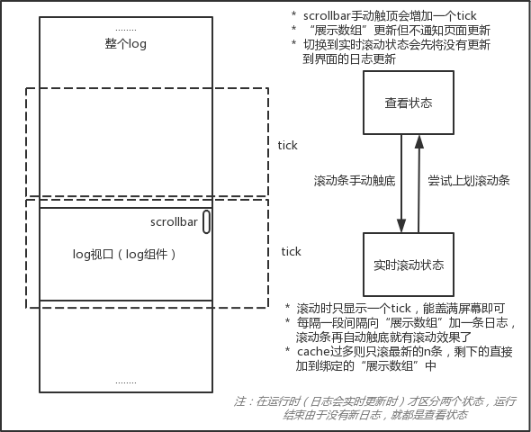

# vue组件之日志滚动窗口

## 项目地址
* [github](https://github.com/yuyue94/gliding-window-log)
* [在线demo](http://120.77.159.124:40072/gliding-window-log/index.html)

## 背景
* 后台有连续输出的大量日志，需要前端来展示
* 后台的日志可能通过前端轮询请求ajax，或者websocket输出到前端

## 最简单的想法

* 前端通过ajax轮询向后台请求日志，日志直接放到cache里面
    * “cache数组”名字叫cache
* 每隔100毫秒从cache里面取出一条日志放到与日志组件绑定的数组里
    * 与组件绑定的“展示数组”叫output
    * 频率也可以根据cache当前缓存的日志数来调，不一定固定死100毫秒 
    * 每次output更新，重绘组件，日志打出
        * 日志打出后再将scrollbar滚至底端就有滚动输出的效果了
        * 由于vue有[列表渲染的复用机制](https://cn.vuejs.org/v2/guide/list.html#key)，日志少的情况下，数组频繁更新导致页面频繁更新也不会卡
    
```js
// cache是cache
// output是与组件双向绑定的数组
// toCache是请求获取到数据后的回调函数
// addLine是每次向outpuListShow数组加一条日志，组件即更新
let toCache = function(data) {
    if (data && data.length > 0) {
        [].push.apply(cache, data);
    }
}

let addLine = function() {
    let item = cache.shift();
    if (item) {
        output.push(item.line);
    }
    if (cache.length > 0) {
        let frequency = Math.min(1 / cache.length * 1000, 100);
        setTimeout(addLine, frequency);
    }
}
```

```html
<!-- vue template -->
<div id="log">
    <div v-for="(line, index) in output" :key="index">
        <span class="line-index">{{index}}</span>
        <div v-if="line" class="log-line">
            {{line}}
        </div>
        <br v-else/>
    </div>
</div>
```
# 然而事实没那么简单。。。。

## 要考虑的
1. 日志的总量可能十分庞大，可达几万行到十几万行
    * 这时候因为新增dom元素会导致巨大的回流（[reflow](https://stackoverflow.com/questions/27637184/what-is-dom-reflow)）性能损耗，所以在运行时用户操作滚动条的时候会非常卡，组件刷新也会越来越卡

2. 为了日志滚动输出的效果，会有组件刷新后滚动条自动沉底的操作，在运行时实时打日志和用户操作滚动条看已有日志会有冲突

3. 单次来的日志量也可能很大，但也要保证滚动效果
    * 滚动输出时间可能太长，比如运行完毕动画还在滚

## 一些方案

### 问题1
* 方案1：减少日志组件的dom元素以减少回流性能损耗，比如只用一个div或者pre元素，只更新text来刷日志
    * 治标不治本
    * 说好的滚动动画呢！！
    * jenkins就是这样搞的，但老的日志会定时干掉

* __方案2__：运用滑动窗口，每次只显示固定数量的日志，一个窗口（tick）固定容量（capacity），当用户滚动条触顶新增可视窗口，类似于懒加载，但由于不是异步操作，速度很快，用户基本没有感觉

### 问题2
* 方案1：加一个滚动锁定开关，打开时，锁定滚动条，用户不能操作滚动条，只能看实时输出的日志，关闭时，用户可以像上滚动，日志更新时滚动条不自动沉底
* __方案2__：滚动锁定对用户透明，当运行时分成两个状态，查看状态和实时滚动状态，开始运行默认实时滚动状态，实时刷日志，当用户尝试向上滚动scrollbar时，取消滚动锁定，切换到查看状态，并进行暗箱操作（即output在更新，但不通知组件更新），用户滚动查看已有日志时并不关心有没有新日志输出，当用户将滚动条人工触底时再切回实时滚动状态，用户看到的是最新的日志和滚动更新的效果了（这里也可以是增加下方的滑动窗口看已生成的日志，通过按钮沉到最低，得看具体需求）

### 问题3
* 方案1：根据cache当前日志量实时调整下一次addLine的间隔（上方代码做法），日志多刷新频率就快
    * 然而settimeout也是有最小值的，也不是你想多快就多快的
    * 组件刷新速度也会影响下一次settimeout的操作，就是说如果回流导致页面更新太慢，那么你设置的间隔只会是一个摆设
* __方案2__: 只滚最新的n条，这个n可以自己设置，剩下cache.length-n条就直接扔到output里面了，下一次addLine开始再滚最近的n条



> 图片是所有问题中方案2的描述

## 关键性技术

### element.scrollIntoView(*alignToTop*);
* 将滚动条滚至使该元素处于视口top或bottom的位置，取决于传参，默认为true
* 兼容性IE8+
* 在滚动条触顶，增加新的tick后，需要使滑动条滚至之前触顶时的log位置
```js
var index = this.logWindow[this.logWindow.length - 1].index - this.capacity*this.tick;
if (index > 0 && this.logWindow.length < this.cache.length) {
    this.tick++;
    Vue.nextTick(() => {
        document.getElementById('log-line-'+index).scrollIntoView();
    });
}
```

### 触顶触底判断
* 触顶
```js
e.target.scrollTop === 0
```
* 触底
```
e.target.scrollTop + dom.clientHeight === dom.scrollHeight 
```

### vue黑箱操作
* vue继承了Array的原型，然后复写了[变异方法](https://cn.vuejs.org/v2/guide/list.html#变异方法)，所以直接用数组调用方法会触发侦听，使用Array.prototype.someFunc.apply()不会触发侦听

```js
if (silent) {
    [].push.apply(output, intercept);
} else {
    output = output.concat(intercept);
}
```


